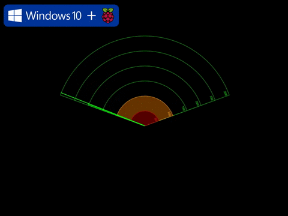

# Windows 10 IoT Core: UltraSonic Distance Mapper

Ever wonder that we can make a device just like RADAR and LiDAR using these sensors! Yes it is possible; but with some limitation. RADAR are the most precise but are much expensive. So let's make our own distance mapper device which acts like RADAR using UltraSonic Distance Sensor (HC-SR04) and a Servo. 

UltraSonic and IrfraRed are basic fundamental sensor for measurement of distance. These sensor measures the distance in the visible sight of them with the range of 80cm to 500cm. Both sensor have their pros and cons. IR are susceptible to sun-lite and are not good in open field.

Read full article @ https://www.hackster.io/AnuragVasanwala/windows-10-iot-core-ultrasonic-distance-mapper-d94d63
